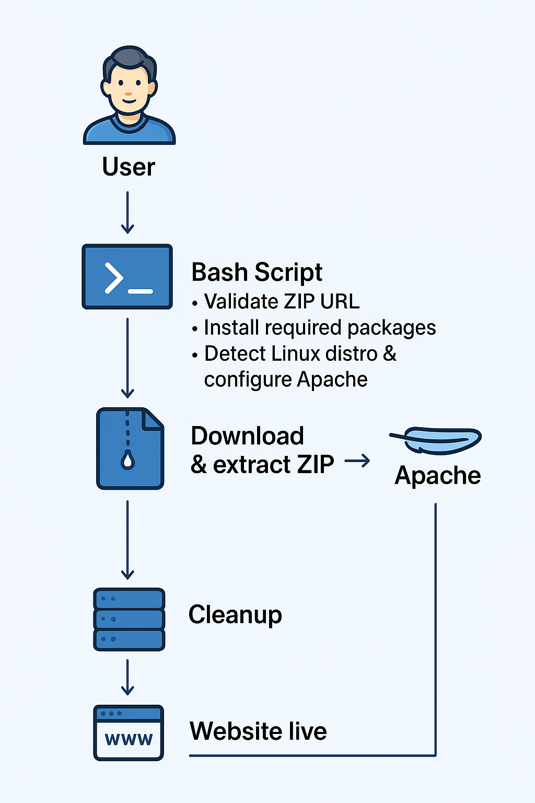

# Static Website Deployment Automation (Bash)

A robust Bash automation script that deploys a static website to an Apache web server from a remote ZIP file.  
This project demonstrates practical **Linux administration**, **Bash scripting**, and **DevOps automation** skills.

---

## 📌 Project Overview

`deploy_static_website.sh` automates the process of deploying static web content on Linux servers in a safe and repeatable manner.

The script:
- Validates user input
- Installs required dependencies
- Configures Apache HTTP Server
- Deploys static web files
- Applies secure permissions
- Handles errors and cleanup automatically

This project focuses on **defensive scripting and automation fundamentals**, rather than full production platform management.

---

## 🧠 What This Project Demonstrates

- Defensive Bash scripting (`set -euo pipefail`)
- Linux OS detection and compatibility handling
- Automated dependency installation
- Apache HTTP Server setup and service management
- File ownership and permission management
- Input validation and structured error handling
- Practical infrastructure automation concepts

---

## ⚙️ Features

- ✔ ZIP URL validation and accessibility check  
- ✔ Supports Debian/Ubuntu and RHEL-based systems  
- ✔ Automatic dependency installation  
- ✔ Apache installation and startup  
- ✔ Static website deployment to `/var/www/html`  
- ✔ Secure permissions and ownership configuration  
- ✔ Automatic cleanup using traps  
- ✔ Clear and actionable error messages  

---

## 🏗️ Architecture Flow

1. User provides a ZIP file URL  
2. Script validates URL format and availability  
3. OS type and package manager are detected  
4. Required packages are installed if missing  
5. Apache HTTP Server is installed and started  
6. Website files are downloaded and extracted  
7. Files are deployed to Apache web root  
8. Permissions and ownership are applied  
9. Cleanup runs automatically  

---

## 📦 Requirements

- Linux system (Debian/Ubuntu or RHEL-based)
- Bash 4+
- `sudo` privileges
- Internet connectivity

---

## 🧰 Dependencies (Auto-installed)

- `curl`
- `wget`
- `unzip`
- `apache2` / `httpd`

---

## 🚀 Usage

### Make the script executable

chmod +x deploy_static_website.sh

Run the script
./deploy_static_website.sh <zip_file_url>

Example
./deploy_static_website.sh https://example.com/website.zip

After successful execution, the website is available via the server’s IP address or domain.

---

## 📁 Deployment Directory
/var/www/html

---

## 🛡️ Error Handling & Safety

This script is written with safety and reliability in mind:

Immediate exit on failure

Input validation for external resources

Controlled privilege usage

Automatic cleanup on exit or interruption

Clear error output for troubleshooting

---

## 🧹 Cleanup Strategy

Temporary files and downloads are removed automatically using a trap, ensuring no leftover artifacts remain.

---

## 🐧 Supported Platforms
OS Family       	        Package Manager     Apache Service
Debian/Ubuntu	            apt-get	            apache2
RHEL/CentOS/Amazon Linux	dnf/yum	            httpd

---

## 🔐 Security Considerations

Correct Apache user ownership (www-data / apache)

Secure permissions applied recursively

No embedded secrets or credentials

Minimal required privileges

---

## 🧪 Tested Environments

Ubuntu 20.04 / 22.04

Amazon Linux 2

CentOS 7 / 8

---

##  📈 Possible Improvements

Add dry-run mode (--dry-run)

Add logging to a file

Add rollback on failed deployment

Add HTTPS support

Add health checks

Add versioned deployments

---

## 📄 License

Apache License 2.0

---

## 👨‍💻 Author

Temitope Michael
DevOps / Cloud Engineer
Focused on automation, cloud infrastructure, and reliable systems.